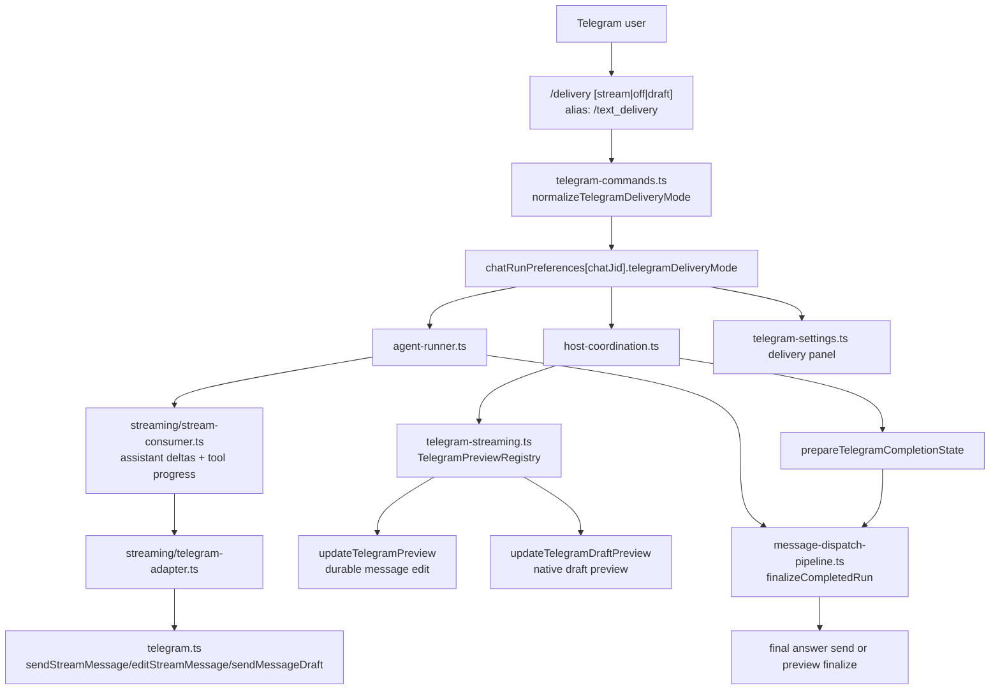

# Telegram Integration

Primary files:

- `src/telegram.ts`
- `src/telegram-format.ts`
- command handling in `src/index.ts`

## Chat JID Format

Telegram chat IDs are normalized as `telegram:<numeric-chat-id>`.

Helpers:

- `isTelegramJid(jid)`
- `parseTelegramChatId(jid)`

## Polling and State

`createTelegramBot(...).startPolling(...)` uses long polling (`getUpdates`) and persists `offset` in:

- `data/telegram_state.json`

Telegram Bot API constraints to preserve:

- `getUpdates` long polling uses monotonically advanced offsets; it does not work while an outgoing webhook is configured.
- `setWebhook` supports a `secret_token`, which Telegram returns in the `X-Telegram-Bot-Api-Secret-Token` header.
- `sendMessage`, `editMessageText`, and `sendMessageDraft` cap text at 4096 characters after entity parsing.
- `sendMessageDraft` is Telegram's native ephemeral preview API; drafts are temporary and the finalized answer must still be sent with `sendMessage`.

Source: [Telegram Bot API](https://core.telegram.org/bots/api/).

Handled update kinds:

- `message`
- `edited_message`
- `callback_query`

## Inbound Message Normalization

Message abstraction includes:

- chat metadata
- sender metadata
- message type (`text|photo|video|voice|audio|document|sticker|location|contact|unknown`)
- optional media payload (`fileId`, size, mime, filename)

Mention handling:

- if bot username mention is present and no trigger exists, content is rewritten to prepend `@<ASSISTANT_NAME>` for non-command messages.

## Outbound Behavior

`sendMessage` path:

1. split markdown text into safe chunks
2. render markdown -> Telegram HTML safely
3. retry on transient API errors
4. fallback to plain text if HTML entity parse fails

Typing indicator:

- `setTyping(chatJid, true)` starts periodic `sendChatAction(typing)` refresh loop
- disabled when run completes

## `/delivery` Text Preview Preference

`/delivery` is a per-chat Telegram text streaming preference. It is not cron result delivery. The alias `/text_delivery` reaches the same handler.

Public modes:

- `stream`: default. Sends a durable preview message with `sendStreamMessage`, edits it as assistant/status text arrives, then finalizes the same message when possible to avoid duplicate final sends.
- `off`: disables Telegram preview streaming for the chat. The container run receives `suppressPreviewStreaming`, and the user receives only the final durable answer.
- `draft`: sends in-flight assistant/status text through native `sendMessageDraft`. Drafts are ephemeral; finalization does not treat the draft as a delivered answer, so the final response is still sent as a normal message.

Legacy aliases normalize to public modes:

- `partial`, `append`, `persistent`, `progress`, `live`, `transcript`, and related stream terms normalize to `stream`.
- `final`, `quiet`, and `final-only` normalize to `off`.

Implementation map:

Notes:

- `TelegramDeliveryMode` still includes `partial` and `append` for legacy state compatibility, and `host-coordination.ts` still has an `append` branch. The `/delivery` command no longer exposes those as real modes.
- Draft-mode assistant deltas and verbose tool progress are routed through `StreamConsumer` to `sendMessageDraft`; no durable preview message is created for those updates.
- `skills/runtime/fft-telegram-ops/SKILL.md` is the repo-tracked operator skill for Telegram workflows and should stay aligned with this command surface.

## Hermes Comparison

Hermes and FFT_nano both use Telegram as an operator-facing channel, but the delivery model is different:

- Hermes uses a generalized delivery system: `DeliveryTarget`, `DeliveryRouter`, and `send_message` can target `telegram`, `telegram:chat_id`, and `telegram:chat_id:thread_id`.
- FFT_nano uses a chat-runtime preference: `/delivery` changes how one Telegram chat sees in-flight assistant text for the current host runtime.
- Hermes Telegram is a `python-telegram-bot` adapter inside a multi-platform gateway.
- FFT_nano Telegram is a custom TypeScript Bot API client in `src/telegram.ts`, with preview delivery split across `telegram-delivery.ts`, `telegram-streaming.ts`, `streaming/stream-consumer.ts`, and finalization in `pipeline/message-dispatch-pipeline.ts`.
- Hermes exposes Telegram behavior through broad toolsets and `send_message`; FFT_nano exposes Telegram operations through command panels and `skills/runtime/fft-telegram-ops/SKILL.md`.

## Media Download

`downloadFile(fileId)` does:

1. `getFile`
2. fetch from `/file/bot<TOKEN>/<file_path>`
3. return `Buffer` and metadata

Host persistence path for inbound media (registered groups only):

- `groups/<group>/inbox/telegram/<timestamp>_<msgid>_<sanitized-name>.<ext>`
- exposed to agent as `/workspace/group/inbox/telegram/...`

Size guard:

- max bytes from `TELEGRAM_MEDIA_MAX_MB`
- checked both hinted size and downloaded size

## Command Menu Scopes

Startup refresh writes:

- default command scope for all chats (common commands)
- chat-specific command scope for main chat (common + admin commands)

If main chat changes, previous main scope is reset.

## Command Surface (From `src/index.ts`)

Common:

- `/help`
- `/status`
- `/id`
- `/models [query]`
- `/model [provider/model|reset]`
- `/think [off|minimal|low|medium|high|xhigh]`
- `/reasoning [off|on|stream]`
- `/new` and `/reset`
- `/stop`
- `/usage [all|reset]`
- `/queue ...`
- `/compact [instructions]`

Admin-only (main chat):

- `/main <secret>`
- `/freechat add|remove|list`
- `/tasks`
- `/task_pause <id>`
- `/task_resume <id>`
- `/task_cancel <id>`
- `/groups`
- `/reload`
- `/panel`
- `/coder <task>`
- `/coding <task>`
- `/coder-plan <task>`
- `/coder_plan <task>`
- `/subagents ...`

## Callback Panel Actions

Inline button callback data:

- `panel:tasks`
- `panel:coder`
- `panel:groups`
- `panel:health`

Only executable in main chat.
